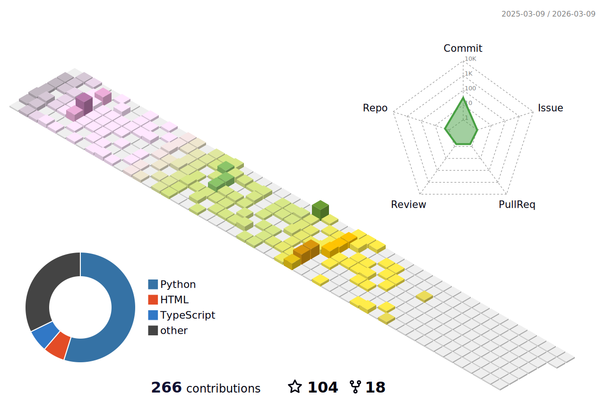

### Hello, I'm Jose Tolentino👋 

## I am a Mechatronics Engineer based in Peru
- 🔭 I'm currently working @QbAI as a Software Engineer

	
	
<ul>
<li> 💬 Languages & Technologies: Shell, C, C++, Java, C#, Matlab, Labview, Python, HTML5, Django, Ruby on Rails, React, PHP, PostgreSQL, CSS, Bootstrap, GNS3, Ansible, Jinja, Podman-containers, JavaScript, Android Studio, ROS, Unity, RTOS, Figma, Adobe XD, Inkscape </li>
<li> 📫 CAD software: Autocad, Solidworks & Solidworks Electrics, Altium PCB </li>
<li> 👀 I’m interested in creating new devices that tap into cutting edge technologies </li>
<li> 📫 How to reach me: jose_antoniotv@hotmail.com </li>
<li> ⚡ Fun fact: I love playing the guitar! </li>
<li> 😄 More of my projects are being uploaded in my spare time </li>
<li> 🌱 I’m currently learning to write code for drivers </li>
</ul>

### Connect with me

<!-- 
 -->

 
 

### Github Stats

	
	

	
	

### Technology Stack

[orcid]: https://orcid.org/0000-0002-2350-2113

<table width="320px">
    <tbody>
        <tr valign="top">
            <td width="80px" align="center">
            <strong>Python</strong> 
            
            </td>
            <td width="80px" align="center">
            <strong>JavaScript</strong> 
            
            </td>
            <td width="80px" align="center">
            <strong>Matlab</strong> 
            
            </td>
            <td width="80px" align="center">
            <strong>Java</strong> 
            
            </td>
            <td width="80px" align="center">
            <strong>HTML</strong> 
            
            </td>
            <td width="80px" align="center">
            <strong>CSS</strong> 
            
            </td>
            <td width="80px" align="center">
            <strong>React</strong> 
            
            </td>
            <td width="80px" align="center">
            <strong>git</strong> 
            
            </td>
            <td width="80px" align="center">
            <strong>GitHub</strong> 
            
            <td width="80px" align="center">
            <strong>Bash</strong> 
            
            </td>
        </tr>
        <tr valign="top">
            <td width="80px" align="center">
            <strong>Latex</strong> 
            
            </td>
            <td width="80px" align="center">
            <strong>&nbsp&nbsp;&nbsp;C&nbsp&nbsp;&nbsp;</strong> 
            
            </td>
            <td width="80px" align="center">
            <strong>&nbsp;&nbsp;C#&nbsp;&nbsp;</strong> 
            
            </td>
            <td width="80px" align="center">
            <strong>&nbsp;&nbsp;C++&nbsp;</strong> 
            
            </td>
            <td width="80px" align="center">
            <strong>PostgreSQL</strong> 
            
            </td>
            <td width="80px" align="center">
            <strong>Dart</strong> 
            
            </td>
            <td width="80px" align="center">
            <strong>Swift</strong> 
            
            </td>
            <td width="80px" align="center">
            <strong>Kotlin</strong> 
            
            </td>
            <td width="80px" align="center">
            <strong>Flutter</strong> 
            
            </td>
            <td width="80px" align="center">
            <strong>Unity</strong> 
            
            </td>
        </tr>
    </tbody>
</table>

##  📫 My contributions so far!

